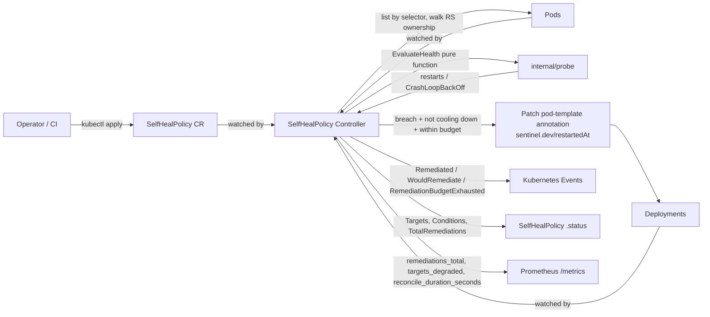

# sentinel

**A self-healing Kubernetes operator: watch Deployment health, restart what's broken, and know when to stop.**

[](https://github.com/rajanshxrma/sentinel/actions/workflows/ci.yml)
[](go.mod)
[](LICENSE)

## Why

Kubernetes will restart a crashing container forever. That's the problem: `CrashLoopBackOff` is a symptom, not a fix, and a naive "restart it again" script just burns cluster capacity in a loop that never resolves. Sentinel adds the piece Kubernetes doesn't have out of the box — a **remediation budget**. It watches Deployments through a `SelfHealPolicy` custom resource, and when a target crosses its failure threshold, it triggers a real rolling restart (the same mechanism as `kubectl rollout restart`). But it only does that a bounded number of times within a window. Once the budget is exhausted, the target flips to `Degraded` and Sentinel stops touching it — that's the signal that automated remediation isn't the answer anymore and a human needs to look. That safety valve, not the restart itself, is the point of this project.

Built as a from-scratch, resume-grade controller-runtime project: real reconcile loop, real RBAC, real tests at three layers (unit, envtest, kind e2e), a hand-authored Helm chart, and CI.

## Architecture



The controller watches three object kinds: the `SelfHealPolicy` itself (`For`), and `Deployment`/`Pod` objects (`Watches` with a selector-matching map function), so it reacts within milliseconds of a real event instead of waiting out the periodic requeue.

## CRD reference: `SelfHealPolicy` (apps.sentinel.dev/v1alpha1)

### Spec

| Field | Type | Default | Description |
|---|---|---|---|
| `selector` | `metav1.LabelSelector` | required | Which Deployments in this namespace this policy manages. |
| `failureThreshold` | `int32` | `3` | Restarts within `observationWindow` (or an active `CrashLoopBackOff`) needed to mark a target unhealthy. |
| `observationWindow` | `metav1.Duration` | `5m` | Sliding window restarts are counted against. |
| `cooldown` | `metav1.Duration` | `10m` | Minimum time between two remediations of the same target. |
| `maxRestarts` | `int32` | `5` | Remediation budget: max remediations per target within `maxRestartsWindow`. |
| `maxRestartsWindow` | `metav1.Duration` | `1h` | Window the budget is enforced over. |
| `dryRun` | `bool` | `false` | Evaluate and emit events/metrics, but never patch a Deployment. |

### Status

| Field | Type | Description |
|---|---|---|
| `conditions` | `[]metav1.Condition` | `Ready` (controller is evaluating) and `Degraded` (at least one target exhausted its budget). |
| `targets` | `[]TargetStatus` | Per-Deployment health/remediation state, rebuilt every reconcile. |
| `targets[].phase` | enum | One of `Healthy`, `Remediating`, `CoolingDown`, `Degraded`. |
| `totalRemediations` | `int64` | Lifetime remediation count for the whole policy. |
| `observedGeneration` | `int64` | Most recent `spec` generation the controller has processed. |

## Quickstart

Requires `kind`, `helm`, `kubectl`, and Docker.

```sh
# 1. spin up a local cluster
kind create cluster --name sentinel-demo

# 2. build and load the manager image
docker build --platform linux/arm64 -t sentinel:dev .
kind load docker-image sentinel:dev --name sentinel-demo

# 3. install the chart (CRDs included)
helm upgrade --install sentinel charts/sentinel \
  --namespace sentinel-system --create-namespace \
  --set image.repository=sentinel --set image.tag=dev \
  --set image.pullPolicy=Never --set metrics.secure=false

# 4. deploy something that's going to crash, and a policy to watch it
kubectl apply -f - <<'EOF'
apiVersion: apps/v1
kind: Deployment
metadata:
  name: crashy-app
  labels: {app: crashy-app}
spec:
  replicas: 1
  selector: {matchLabels: {app: crashy-app}}
  template:
    metadata: {labels: {app: crashy-app}}
    spec:
      containers:
        - name: app
          image: busybox
          command: ["sh", "-c", "sleep 3600"]
          livenessProbe:
            exec: {command: ["cat", "/tmp/healthy"]}
            initialDelaySeconds: 1
            periodSeconds: 2
            failureThreshold: 1
---
apiVersion: apps.sentinel.dev/v1alpha1
kind: SelfHealPolicy
metadata:
  name: crashy-app-policy
spec:
  selector: {matchLabels: {app: crashy-app}}
  failureThreshold: 2
  observationWindow: 2m
  cooldown: 10s
  maxRestarts: 2
  maxRestartsWindow: 5m
EOF

# 5. watch it heal, then degrade once the budget is spent
kubectl get selfhealpolicy crashy-app-policy -w
```

## Development

```sh
make manifests generate   # regenerate CRD YAML + DeepCopy code after editing api/
make test                 # unit (internal/probe) + envtest (internal/controller), no Docker required
make lint                 # golangci-lint
make test-e2e              # full kind e2e suite (builds+loads the image, helm installs, asserts real healing)
make run                  # run the controller against your current kubeconfig, out of cluster
```

Unit tests only, with verbose output: `go test ./internal/probe/... -v`.

## Observability

The manager exposes Prometheus metrics on `:8443` (HTTPS by default, matching the kubebuilder convention; set `metrics.secure=false` in the chart for plain HTTP in dev/kind):

| Metric | Type | Labels | Meaning |
|---|---|---|---|
| `sentinel_remediations_total` | Counter | `namespace`, `policy`, `deployment` | Rolling restarts actually patched (dry-run evaluations are excluded — see below). |
| `sentinel_targets_degraded` | Gauge | `namespace`, `policy` | Current count of targets in the `Degraded` phase for that policy. |
| `sentinel_reconcile_duration_seconds` | Histogram | — | Reconcile loop latency. |

Events emitted on the `SelfHealPolicy` object: `Remediated`, `WouldRemediate` (dry-run), `RemediationFailed`, `RemediationBudgetExhausted`.

## Design decisions and tradeoffs

- **kubebuilder scaffold, not hand-rolled.** The canonical `kubebuilder init` / `create api` layout is itself part of the signal for an infra-hiring audience familiar with controller-runtime conventions — it's the shape reviewers expect to open.
- **In-memory ledger + Status as durable mirror.** Cooldown and budget checks read a mutex-guarded, in-process map (`internal/controller/ledger.go`) instead of round-tripping through the API server on every check. `Status.Targets[].RemediationCount`/`LastRemediation` is the durable record; on a controller restart, the ledger is seeded from the last known Status the first time a target is reconciled. The real tradeoff: a restart resets the ledger's precise timestamp history to a single seeded point, so cooldown timing right after a restart is an approximation, but the remediation *count* the budget enforces is never lost.
- **No finalizer.** The controller only ever annotation-patches Deployments it doesn't own; there's no owned/created resource to clean up on delete, so a finalizer would add complexity without a corresponding cleanup responsibility.
- **The Degraded safety-valve is the point.** Any script can restart a crashing pod. The differentiator here is refusing to do it forever: once a target's remediation count within `maxRestartsWindow` reaches `maxRestarts`, the controller stops — no more patches, no more restarts — and flips the target `Degraded` with a `RemediationBudgetExhausted` event so the failure surfaces to a human instead of quietly consuming cluster capacity.
- **Pod discovery walks Deployment → ReplicaSet → Pod ownership**, not a label-match shortcut, so a stale ReplicaSet left behind by a prior rollout (which can still carry matching labels) is never mistaken for a live target.
- **CrashLoopBackOff counts unconditionally; timestamped restarts are windowed.** Kubernetes only reports a cumulative restart count and the timestamp of the *last* restart per container, not full history, so `internal/probe.EvaluateHealth` only counts a container's restarts toward the window if its most recent restart falls inside it — a container that crashed many times long ago and has since stabilized contributes nothing. An active `CrashLoopBackOff` waiting state is always counted, since it's happening right now by definition.

## Roadmap

- Sync the Helm chart's `crds/` copy from `config/crd/bases/` automatically (currently a manual copy step after `make manifests`).
- Optional webhook for spec validation (e.g. `maxRestarts >= 1`) at admission time instead of only via CRD OpenAPI schema.
- Per-target override of thresholds via Deployment annotations, for policies that span heterogeneous workloads.
- Auto-recovery path: currently `Degraded` is sticky until the operator's `maxRestartsWindow` naturally ages the count back down; consider an explicit `kubectl annotate ... sentinel.dev/reset=true` escape hatch.

## License

MIT — see [LICENSE](LICENSE).
